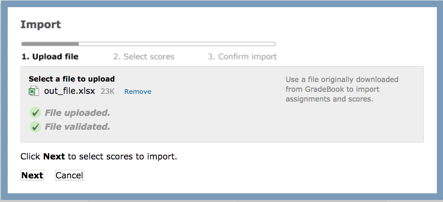
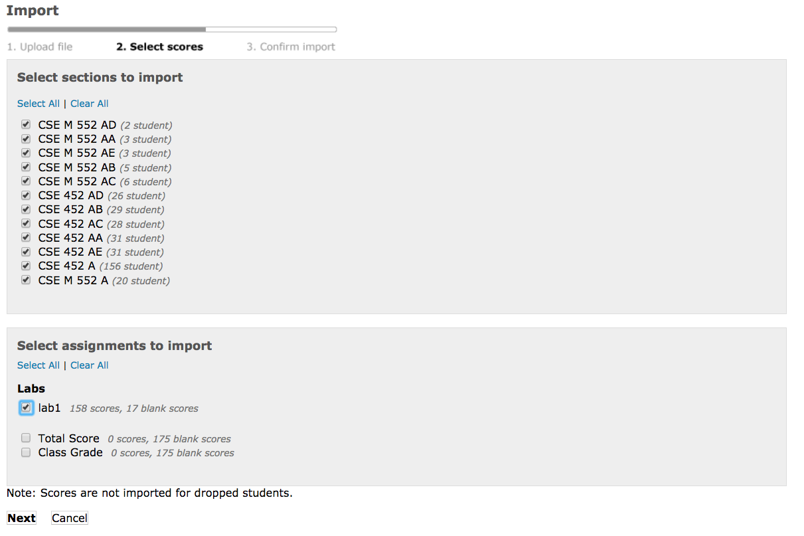
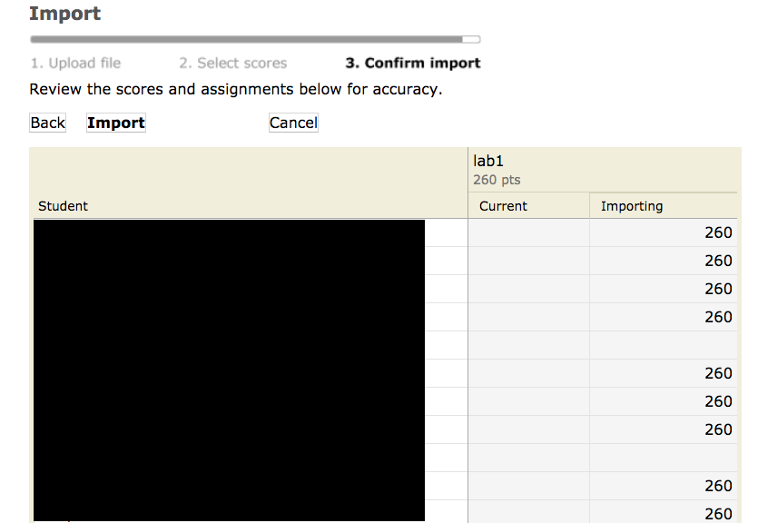

# Grade Exporter

Grade Exporter is a tool that can export the grades to a catalyst gradebook file. 
This gradebook file can then be uploaded to catalyst to upload grades in bulk.

To use the tool:
1. Go to catalyst and to `Add > Add assignment`. Add the assignment and the points value and give it a title like `lab1`.
2. Go to catalyst, `Export or Import > Export > Entire gradebook`. This will download a .xls file of the gradebook. Copy this file to attu (scp, rsync, etc...).
3. Run grade exporter. Here is an example:

```
python grade_exporter.py --gradebook-xls CSE_452_Spring_2018.xls --col lab1 --col-points 260 --output-xls out_file --json ../Grades/Lab1/merged.json
```

The arguments are as follows:
- `--gradebook-xls` is the path to the downloaded excel gradebook from catalyst.
- `--col` is the name of the name of the assignment column name. This should match the name of title of the assignment you added.
- `--col-points` is the number of points for this assignment.
- `--output-xls` is the output file. This should be a path to a file that will be the updated gradebook.
- `--json` is the path to the merged json grades.

4. After you run the script, if everything went well you should see some output and should have an output excel file. Now SCP this output file back to your machine. Note, the script will print if it's missing grades for anybody as a warning.
5. Go back to catalyst and go to Export or Import > GradeBook file > and select the output excel file. 

6. Click Next. For sections, press Select all. For "Select assignment to import", select this assignment you have added.

7. Next, you will see a list of all the grades you are importing. Check that everything looks correct and confirm the import.

