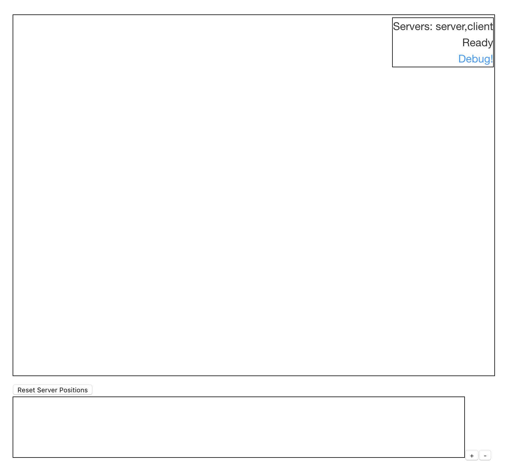
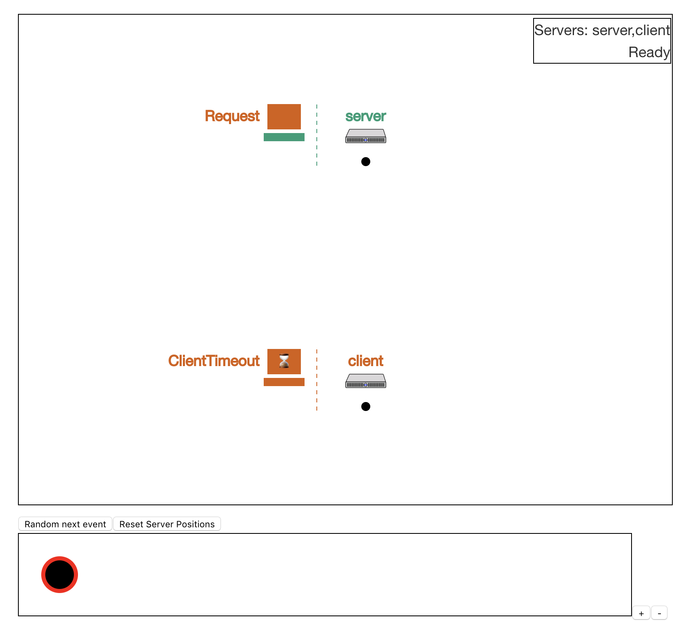
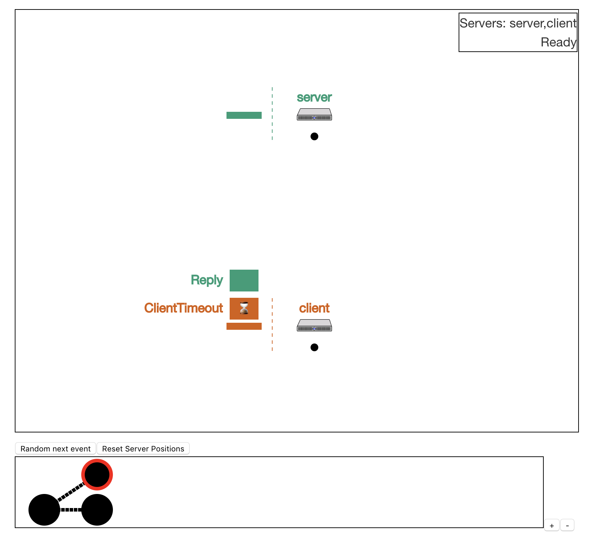
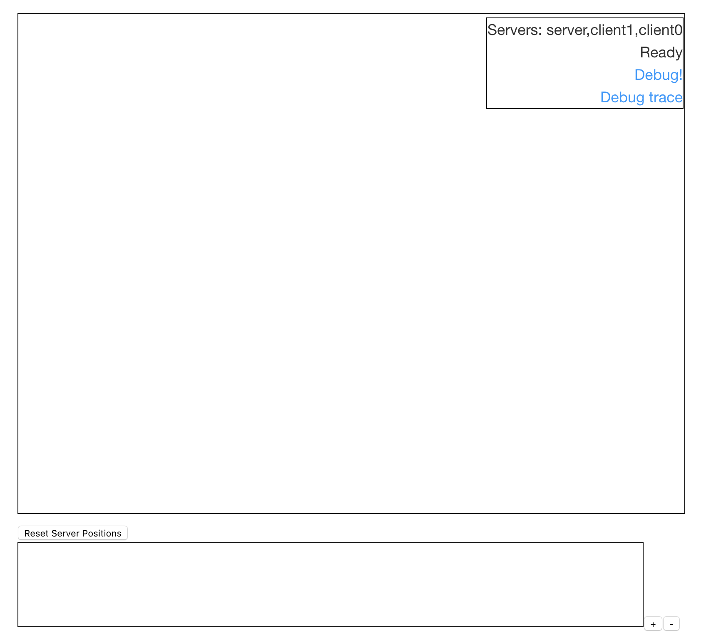
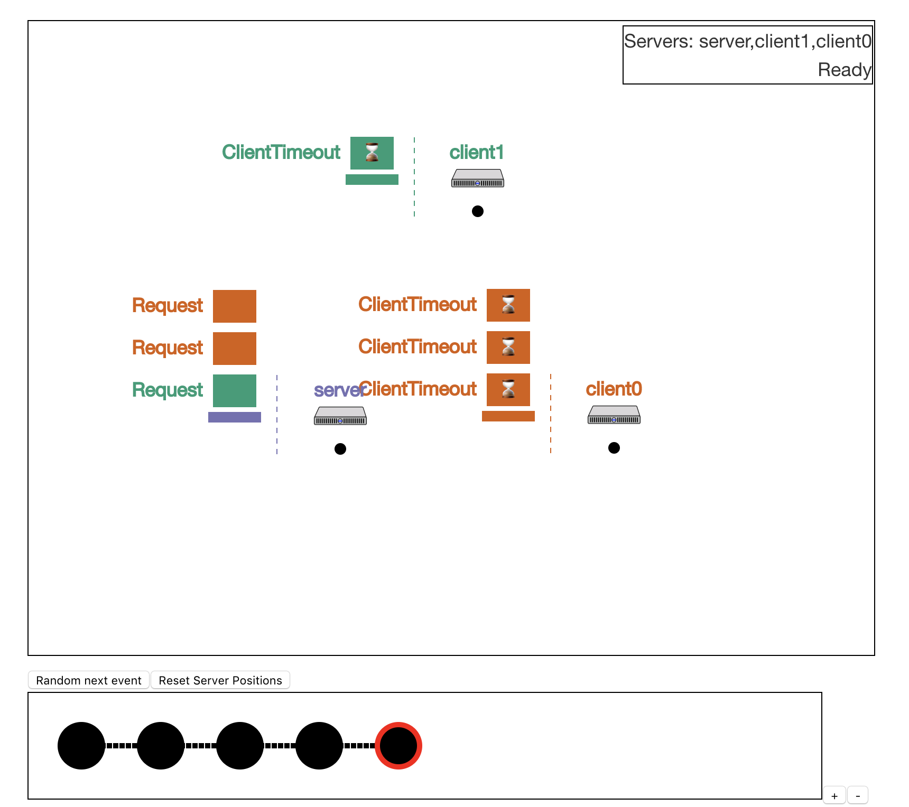

**DO NOT DISTRIBUTE OR PUBLICLY POST SOLUTIONS TO THESE LABS. MAKE ALL FORKS OF
THIS REPOSITORY WITH SOLUTION CODE PRIVATE.**

# Distributed Systems Labs

1. [Introduction](#introduction)
2. [Getting Started](#getting-started)
    1. [On Windows](#on-windows)
3. [Framework Overview and Documentation](#framework-overview-and-documentation)
4. [Included Libraries](#included-libraries)
    1. [Lombok](#lombok)
5. [Tests](#tests)
    1. [Run Tests](#run-tests)
    2. [Search Tests](#search-tests)
6. [Debugging and Logging](#debugging-and-logging)
7. [Visualization](#visualization)
    1. [JSON Issues](#json-issues)
8. [Common Issues](#common-issues)
9. [Important Notes](#important-notes)

## Introduction
Please read the below instructions carefully, and when you are ready, the
individual labs are located in the `labs` folder.

In these labs, you will build a linearizable, sharded key-value store with
multi-key updates and dynamic load balancing, similar in functionality to
Amazon's DynamoDB or Google's Spanner. Don't panic if you don't understand (any
of) these concepts, yet; the point of lecture and the labs is to help explain
those concepts to you.

We get there through five steps:
- Lab 0: Investigate the framework code using a ping server.
- Lab 1: Implement remote procedure call interface supporting many clients
  speaking to a server implementing a key-value store, with exactly-once
  semantics.
- Lab 2: Design and implement a key-value primary-backup replication system for
  the key-value store, such that the system will continue to operate through
  (most) individual server failures.
- Lab 3: Design and implement Paxos management of the key-value store, such that
  the system will continue to make progress provided that a majority of servers
  remain functional
- Lab 4: Add sharding of the key-value store across server groups (each of which
  implements Paxos), with dynamic load balancing and atomic (transactional)
  multi-key updates across server groups.

Lab 0 introduces the framework code and tools; it has no turn-in. Lab 1
demonstrates that you can modify the framework to add some simple functionality
that will be useful in later Labs. It is much easier than the other labs. Lab 2
and Lab 3 are of similar difficulty. Lab 4 is somewhat harder than Labs 2 and 3.

As a baseline, we give you a library that implements typed message passing
between the nodes of a distributed system. This setup is realistic: messages can
be dropped or duplicated in flight; messages can take an arbitrary amount of
time to arrive at the destination (e.g., messages sent before other messages can
arrive at the destination in a totally different order); nodes can fail at any
point; and so forth.

The core intellectual challenge of distributed systems is to build working
systems that produce useful results despite these difficulties. For simplicity,
we assume that nodes have a globally unique ID and fail by permanently crashing
(i.e., they do not restart). Your solutions to each lab are a set of message and
timer handlers for each node in the distributed system, to achieve some desired
system-level behavior. These handlers can change local state and send messages
to other nodes.

Just as the message handler is only invoked if you send a message to that node,
the timer handler on a node is triggered only if you set the timer on the node.
NOTE: Timers are not triggered by default; you must set them for them to be
delivered.

Your handlers only need to support single-threaded access and must be
deterministic. The first property means that on each node, the handlers execute
one at a time, and run to completion. The second assumption asserts that the
node behavior is only a function of the order of messages and timers. If the
messages arrive in the same order, the same output occurs – the same sequence of
message sends and internal state changes.

Lastly, while not necessary, your message handlers should be as idempotent as
possible; idempotence is useful when a network can deliver a message multiple
times. (Question: why might a sender resend a message if the first one was
delivered? Because the sender might not know that the message was successfully
delivered.) Idempotence implies that when multiple copies of the same message
are delivered to a node, the behavior does not change: the same messages are
sent and the internal state only changes as a result of the first message.

These properties combine to allow us to do more thorough testing of your
solutions. For each part of each lab, there are a set of "run tests" that look
for the basic functionality. We then run a set of "search tests" – automated
model checks that systematically try as many message and timer orderings as
possible, to better ensure your solution works in all (rather than just a few)
cases. These include both safety and liveness tests. Safety tests check if
invariants are violated along any code paths. Liveness tests check if some code
path can produce the correct result. For each of the labs, the tests are
cumulative – we test basic functionality first before proceeding to exploring
corner cases.

Finally, we also include a package to produce visualizations of your solutions
to aid in debugging, e.g., to illustrate the sequence of messages, timers,
and/or failures that might lead to a violation of the invariants of the system.

## Getting Started
The only dependency for these labs is Java 14. Installing `openjdk-14-jdk` on
most Linux distros should be sufficient.

For the primary IDE, we also recommend using IntelliJ (a configuration file is
included in each repo), which also has plugin support for Project Lombok (see
below).

In order to run the tests from the terminal, however, you also will need Python
3 and Make.

### On Windows
Because of the messy terminal situation on Windows, we would strongly recommend
using the Bash on Ubuntu on Windows terminal, which will give you a Linux
environment. We recommend installing `python3` and `java14` through `apt-get`.
For IntelliJ, you would have to separately install Java to be able to run tests,
but even though you'd end up with two Java installations (one on the Linux
subsystem and one on native Windows), it'll make your life a lot easier in the
long run.

## Framework Overview and Documentation
Lab 0 provides a simple example of the framework code in action. You are also
strongly advised to read the accompanying documentation for the framework, found
in the `doc` folder (open `index.html` in a browser). You will be creating
subclasses of the provided classes and should understand the contract those
classes need to follow.

Briefly, you will be creating subclasses of the `Node` class by defining
`Message` and `Timer` handlers as well as a special `init` handler. In this
framework, `Node`s are I/O automata; they process events sequentially as
delivered by the environment. They do not need to handle concurrent access, and
all methods should run without blocking or starting other threads. Subclasses of
`Node` can send each other `Message`s and set `Timer`s for themselves through
the `Node` interface. Here, `Timer`s are simply asynchronous callbacks that will
be delivered back to the `Node` once their time expires. Messages may be dropped
or re-ordered depending on the network semantics of the individual lab
(asynchronous and lossy unless otherwise specified), but `Timer`s will always be
delivered (provided that your code asks for a timer -- they don't occur by
default).

Some of your `Node`s will be `Client`s. These `Node`s provide a way for the
external world to use your system. `Client`s in this framework are closed-loop
clients. That is, they will have at most one outstanding request at any given
time. Because the `Client` methods can be called by external code, unlike other
`Node`s, `Client`s do need to be able to handle concurrent access from multiple
threads. Simply declaring all interface methods and handlers `synchronized` is
sufficient.

You will also create subclasses of `Application`, a simple state machine
interface which consumes `Command`s and returns `Result`s. `Application`s should
be deterministic to support state machine replication.

## Included Libraries
We have included a few libraries in the distributed JAR files. Namely:

- [Guava](https://github.com/google/guava)
- [Apache Commons Lang](https://commons.apache.org/proper/commons-lang/)
- [Project Lombok][lombok]
- [JUnit 4](http://junit.org/junit4/) (testing only)

We describe Lombok below. We believe that these libraries should meet your needs
while working through the labs, and when you submit your code, it must run
without any other dependencies. If you have a compelling reason that an
additional library should be added to the distribution (or that a provided
library should be upgraded to a newer version), contact the course staff.

### Lombok
[Project Lombok][lombok] is a library designed to simplify the process of
creating boilerplate code. One of the most basic and useful examples is the
`@EqualsAndHashCode` annotation. Automating the test for object equality is
particularly important for the efficiency of the model checker, as it skips
paths if the node state is the same as some previously explored state. While
IDEs can generate these methods automatically, adding the annotation once and
forgetting about it frees the programmer from potential errors.

You are free to use, or ignore, the rest of Lombok. You should note, however,
that the labs are distributed with a `lombok.config` with a few settings; for
instance, the field name for the logger you get when you apply the `@Log`
annotation is `LOG`, and the getter methods are not prefixed with `get` or `is`.
Also note that in order to use IntelliJ when working on these labs, you'll need
to install the Lombok plugin.

## Tests
To run tests, use the included `run-tests.py` script. It takes a number of
command line arguments to modify the runtime environment that tests are running.
View them with `run-tests.py --help`. Each of these arguments can also be set by
setting a Java system property; this is helpful when running in an IDE, for
example. You are free to add your own tests, as long as you keep them in the
`tst` folder (which will not be included in your submission). However, you are
encouraged to reset the `tst` folders and execute `run-tests.py` with the
default options before submitting.

If your code does not build successfully for tests to run, use `make clean all`
to build the code from scratch and see what the problems are.

Note that unhandled exceptions in your code will cause error messages to be
logged but will not crash the running thread. While these exceptions may not
cause tests to be reported as failures, you should take them to be the same as
failures.

Most tests in these labs come in two flavors: run tests and search tests.

### Run Tests
These tests actually run your `Node`s (typically in parallel). A subset of these
tests are marked as "UNRELIABLE," indicating that the network in these tests
will drop some messages.

When debugging these tests, you might find running in single-threaded mode
(`run-tests.py --single-threaded`) to be useful.

### Search Tests
These tests run in "model checking mode," where the testing framework explores
the graph of all reachable states. Here, a "state" is the state of all nodes in
the system, the state of the network (i.e., the messages currently in the
network), and the timers pending for each node. By default, search tests assume
a fully asynchronous network in which messages can be dropped, re-ordered, and
even duplicated. Timers will be delivered in an order respecting their durations
(i.e. if the maximum timer length for `t1` is less than or equal to the minimum
timer length for `t2` and `t1` is set before `t2`, then `t1` will be delivered
before `t2`).

All `Node`s, `Message`s, and `Timer`s must properly implement `equals`,
`hashCode`, and `toString` to pass these tests. Furthermore, they must be
`Serializable` (i.e., all data structures they encompass must be
`Serializable`). Usually, all that is needed to make a data structure
serializable is to have the class implement the empty `Serializable` interface.

Running `run-tests.py --checks` for a lab will attempt to report possible errors
with that lab's code. While some of the reported items are always errors (e.g.,
a clone of a state not being equal to itself), others are not (e.g., some
message and timer handlers are not supposed to be idempotent). Furthermore, some
of these checks rely on non-exhaustive model checking; just because they do not
report a certain error doesn't mean the problem doesn't exist.

## Debugging and Logging
Use of an IDE is strongly recommended; an IntelliJ project configuration is
included in the handout files. Java has excellent support for debugging, even
for multi-threaded applications.

Should you want to log any data, you can use the `java.util.logging` package,
available in any class conveniently with the `@Log` Lombok annotation. An
argument to `run-tests.py` will let you change the logging level; the default
logging level is `WARNING`. *IMPORTANT:* Make sure your code doesn't emit
logging statements (or `println`s) before submitting (e.g., by only logging at
levels lower than `WARNING`).

The framework has built-in logging of all delivered messages and timers at the
`FINER` level (see it with `run-tests.py -g FINER`), and all sent messages and
set timers at the `FINEST` level (see it with `run-tests.py -g FINEST`). This
may be useful for run tests. You can add additional instrumentation to the
`send`, `broadcast`, `set`, `handleMessage`, and `onTimer` methods of `Node` by
overriding those methods (and calling the `super` method of course).

## Visualization
Included in this handout is a tool for visualizing and graphically debugging
executions of distributed systems. You can run it in two different ways. First,
you can start any lab from its initial state by calling `./run-tests.py --lab N
--debug NUM_SERVERS NUM_CLIENTS WORKLOAD`, where `WORKLOAD` is a comma-separated
list of commands for the clients to send (e.g.,
`PUT:foo:bar,APPEND:foo:baz,GET:foo`). You can even write custom parsers for the
arguments to `--debug` by overriding `getInitialState(String[] args)` in the
relevant subclass of `VizConfig`. The visualization tool will startup Google
Chrome, which is the only supported browser at this time. If it cannot open a
Chrome window, you should open a Chrome tab manually and navigate to
`localhost:3000`. Once your list of servers appears in the top-right, click on
"Debug!".

Your servers should now appear in the main window. Each server has a "queue" of
timers and messages waiting to be delivered to it. Clicking on any message or
timer will deliver it to that server. Right-clicking on a message, timer, or
server will show more information about its state.

The servers are positioned in a circle by default. With more than 3 or 4
servers, this view can be cluttered. Servers can be repositioned by clicking and
dragging the black dot below each server.

The bottom window shows a history of the "events" that have occurred; each
message or timer delivered corresponds to an event. Clicking on states in this
history allows you to "time travel" by going back to previous states of your
system. If you choose a different event than was executed before--for instance,
delivering a timer instead of a message--the history will branch. This enables
exploration of multiple possible system traces.

The debugger has a couple of keyboard shortcuts for navigating the history: "n"
will go the next event, and "p" will go to the previous event.

The second way you can run the visualization tool is using it to visualize
invariant-violating traces in search tests. You can have the test runner start
the visualization when it hits an invariant violation by attaching the
`--start-viz` flag (e.g., `./run-tests.py --lab 1 --start-viz`). Once the
browser window is opened as before and the list of servers is displaying, click
"Debug trace".

Now, the visualization tool will be pre-populated with the invariant-violating
trace, the last state of which actually violates one of the invariants being
tested for. You can explore this trace by using the history navigation tools
described above. You can also click on messages or timers to explore alternate
traces branching off the one that violated the invariant.

### Run-until
You can save some time by asking the visualization tool to find a state matching
a particular predicate. Click "Run Until" and then "Predicate":

Enter a predicate in the window that pops up. Predicates have the form
`<server-name>.<path> = <value>`, for instance, `server1.proposer.ballot = 4` or
`server2.leader = true`. If the visualization tool cannot find such a state
after 10 seconds, it will time out.

### JSON Issues
If your `Node`s, `Message`s, or `Timer`s contain circular references, you may
run into issues using the visualization tool. In this case, you will have to
remove the circular references or define custom JSON serializers for the
offending classes. The testing framework uses the
[Jackson](https://github.com/FasterXML/jackson) library for JSON serialization.
To define a custom serializer for class `Foo`, first create a class which
extends `StdSerializer<Foo>` (e.g., `FooSerializer`). Then, add the
`@JsonSerialize(using = YourFooSerializerClass.class)` annotation to the `Foo`
class.

---

### Common Issues
- If search tests fail to find states that should be reachable and only finds a
  few unique states, make sure `equals` and `hashCode` are properly implemented
  for your nodes, messages, and timers (especially if you created any classes).
- Using `==` instead of `equals` in your code for references (non-primitives) is
  almost always wrong. The test infrastructure will clone (i.e.
  serialize/deserialize) your nodes, messages, and timers, breaking pointer
  equality.
- If your search tests time out because there are too many unique states, check
  that all of your message and timer handlers are *deterministic*. Also, you'll
  want as many of them to be idempotent as possible.
- Your code should not acquire any locks, except in clients by using
  `synchronized` on handlers and the client interface methods. In particular,
  your nodes should allow simultaneous access to their `equals` and `hashCode`
  methods without locking or waiting. All other concurrency is handled by the
  framework. Use of locking data structures (e.g. `Hashtable`) is likely to
  cause search tests to deadlock.
- Do not use any static, mutable fields in your classes (constants are fine).
  Your nodes (i.e., instances of the `Node` classes) should communicate only
  through message passing.

### Important Notes

- Do not publicly publish your solutions or the skeleton code. If you would like
  to keep your solutions on GitHub, GitLab, etc., *make the repo private.*
- We strongly suggest keeping your code in a Git repository. You might need to
  update the skeleton code periodically, and the most convenient way of doing
  that will be merging the changes from the handout repository.

[lombok]: https://projectlombok.org/
